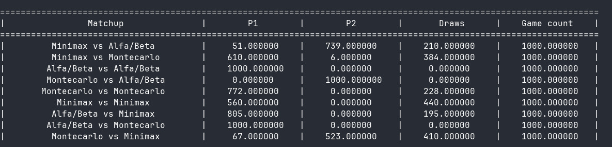

# AI Tic Tac Toe

[Link to Video](https://youtu.be/gdIsusDnZ1g)

Each AI must implement the player interface!

https://github.com/DanielRasho/IA-lab6/blob/9b5e2175f2de2596b4523a127e507eba123c3562/simulation/game.go#L7-L12

If you need any initialization logic please add it in this method:

https://github.com/DanielRasho/IA-lab6/blob/d8c6235ea60e8b8fcdc79de9e996eb7ddb719c7b/main.go#L73-L80

If you have any doubts don't hesitate to ask questions or check the Human player
example!

## Discusion

Benchmarks were performed with two search algorithms. It can be observed that
the algorithm that performs best is Alpha-Beta Pruning, achieving more victories
against different opponents, both against other AIs and against itself.

It is also interesting to note that the order in which the opponents play also
affects their number of victories. In general, players who place the first piece
tend to have more wins.

Finally Montecarlo had a really poor performance, which may be caused by bad optimizations on the searching algorithm or no to extensive exploration of the tree during the aleatory exploration phase.

In general, it can be concluded that Alpha-Beta Pruning has better performance for selecting optimal moves.

